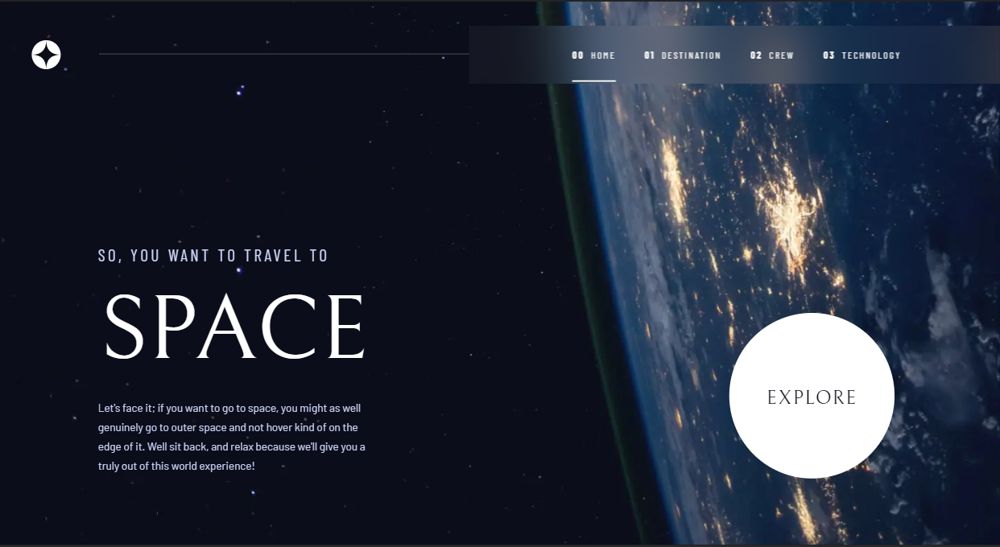

# Frontend Mentor - Space tourism website solution

This is a solution to the [Space tourism website challenge on Frontend Mentor](https://www.frontendmentor.io/challenges/space-tourism-multipage-website-gRWj1URZ3). Frontend Mentor challenges help you improve your coding skills by building realistic projects.

## Table of contents

- **[Overview](#overview)**
  - [The challenge](#the-challenge)
  - [Screenshot](#screenshot)
  - [Links](#links)
- **[My process](#my-process)**
  - [Built with](#built-with)
  - [What I learned](#what-i-learned)
  - [Useful resources](#useful-resources)
- **[Author](#author)**

## Overview

### The challenge

Users should be able to:

- View the optimal layout for each of the website's pages depending on their device's screen size
- See hover states for all interactive elements on the page
- View each page and be able to toggle between the tabs to see new information

### Screenshot



### Links

- Solution URL: [Add solution URL here](https://github.com/KarimAyman97/space-tourism)
- Live Site URL: [Add live site URL here](https://space-tourism-o9i9j1js7-karimayman97.vercel.app/)

## My process

### Built with

- Semantic HTML5 markup
- CSS custom properties
- Flexbox
- Mobile-first Design
- [React](https://reactjs.org/) - JS library
- [Next.js](https://nextjs.org/) - React framework

### What I learned

I learnt how to use Next.js Routing file structure , and how to use animations using TransitionGroup and CSSTransition
and how to use SCSS rather than CSS with next.js

```JSX
const Animation = ({
  index,
  children,
  className,
}: {
  index: number;
  children: ReactElement;
  className?: string;
}) => {
  return (
    <TransitionGroup className={className || ""}>
      <CSSTransition
        key={index}
        timeout={600}
        classNames={{
          enter: styles.animEnter,
          enterActive: styles.animEnterActive,
          exit: "hidden",
        }}
      >
        {children}
      </CSSTransition>
    </TransitionGroup>
  );
};
```

### Useful resources

- [FrontEnd Mentor Solution ](https://www.frontendmentor.io/solutions/space-tourism-website-with-nextjs-and-tailwindcss-qgIuCdMidQ) - This Solution Helped me alot in making Transition i Learnt alot thanks to this solution .
- [Detect window size](https://stackoverflow.com/a/63408216) - This solution helped me to finally learn detecting window size in `Next.js` and `React`.

## Author

- _Github_ - [@karim_Ayman](https://github.com/KarimAyman97)
- _Frontend Mentor_ - [@Karim_Ayman](https://www.frontendmentor.io/profile/KarimAyman97)
- _LinkedIn_ - [@karimAyman](https://www.linkedin.com/in/karimayman97/)
